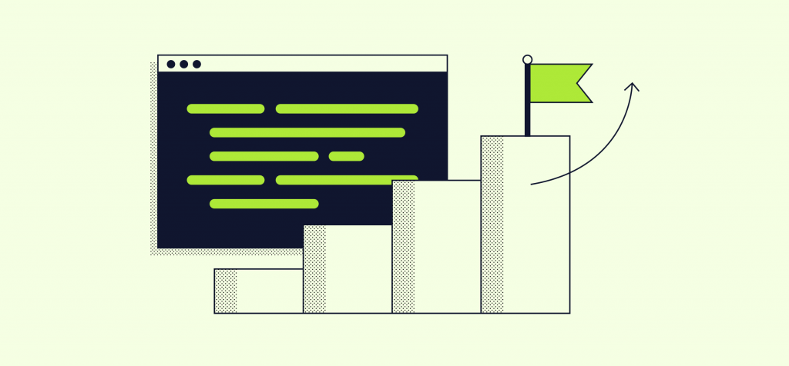
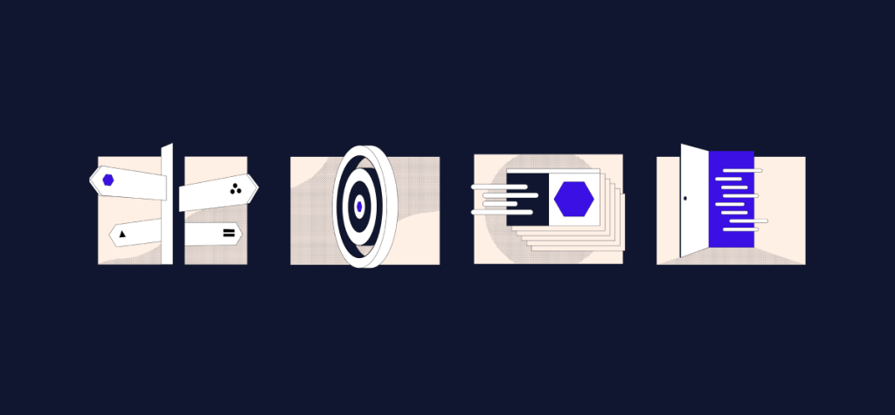
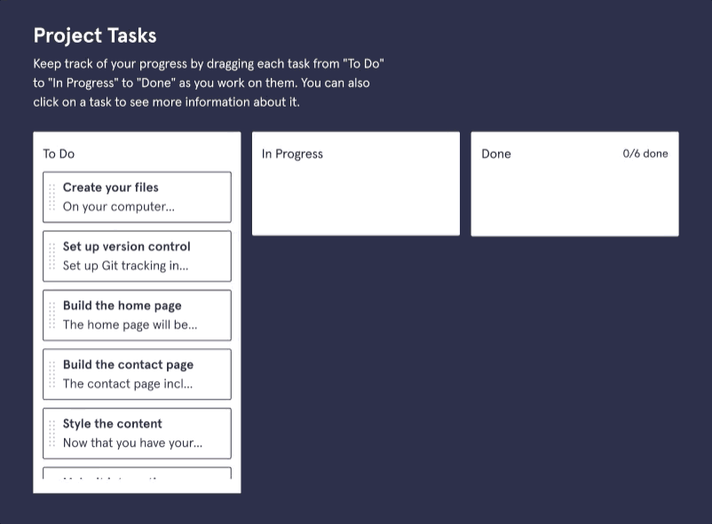
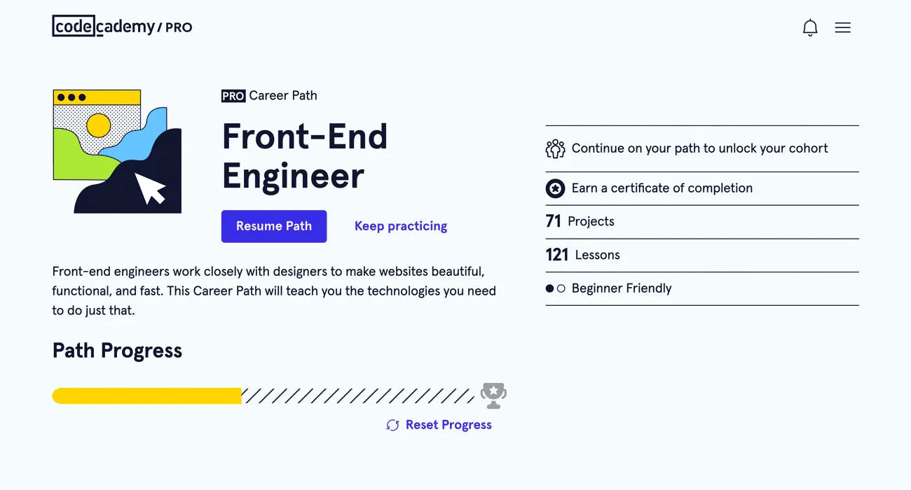

# Make the Most of Your Codecademy Membership

#### Learn about the different features Codecademy has to offer!

Codecademy has helped [tens of millions of people](https://www.codecademy.com/learner-stories) to learn to code,  
everything from **hello world** to getting new tech jobs, but when it comes down to it, you get out what you put in.  
If you want to be best set up for success, this guide is for you.

## Valuable Resources

There are hundreds of hours of free content on Codecademy, and thousands of hours of material available with our paid plans;  
but no matter your membership level, the key to success is learning intelligently.  
If you build the habits to use our features, it will be easier for you to master technical skills.

### Mobile App

Keep practicing and stay sharp as you go with our free mobile app on [iOS](https://itunes.apple.com/us/app/codecademy-pro/id1376029326?ls=1&mt=8) and [Android](https://play.google.com/store/apps/details?id=com.ryzac.codecademygo).

### Workspaces

[Workspaces](https://www.codecademy.com/pages/workspaces) allow learners to work in their own [integrated development environment (IDE)](https://www.codecademy.com/article/what-is-an-ide) right inside Codecademy.  
Build or try whatever you want for free with these unguided sandboxes, share your code, or keep it private.  
Not sure what to make? Grab code from your coursework and use it as a template.

### Cheatsheets

Coding is less about memorization and more about understanding principles;  
cheatsheets help you quickly refresh your memory and get back to work.  
You can find them linked in lessons, or head to their [homepage](https://www.codecademy.com/resources/cheatsheets/all) to find them all, broken down by the course section in which you learned them.

### Docs

Cheatsheets are a handy companion for consuming coursework,  
but when coding in the real world, programmers need documentation.  
With [Docs](https://www.codecademy.com/resources/docs), you have an entirely open-source, free reference material to cover far more than a course can.

### Learn What to Learn

Not certain what language to pick up or what career path to choose?  
Flick through the [Learn What to Learn course](https://www.codecademy.com/learn/learn-what-to-learn),  
where we’ve consolidated the best resources to help you make a choice with confidence.  
An hour of planning now could save you days of wasted effort later.

There is also an excellent [forum post](https://discuss.codecademy.com/t/guide-essential-things-to-know-about-coding-from-day-one/394538)
by Galina, one of our curriculum developers,  
that discusses how to best get started when beginning your coding journey.

### Community

Learning to code is challenging, but it’s easier if you can team up.  
Ask questions, stay connected, and find motivation with multiple communal experiences through Codecademy:

- [Community forum](https://discuss.codecademy.com/): ask and answer questions about anything on Codecademy.
- [Discord](https://discord.com/invite/codecademy): chat in real-time with other learners across the globe.
- [Chapters](https://community.codecademy.com/): find like-minded people in your area and learn to code together.  
  There are even multiple virtual-first groups to join if you don’t find one nearby.
- [Facebook group](https://www.facebook.com/groups/codecademy.community/): discuss the broader world of coding with tens of thousands of other learners.
- [30-Day Challenge](https://www.codecademy.com/30daychallenge): join others in a sprint to make progress and make learning a habit.

### Video Library

Need a break from the IDE but still want to be productive?  
Watch hundreds of educational and motivational video content on everything  
from basic coding concepts to career advice, all on-topic and [on-platform](https://www.codecademy.com/resources/videos).

## Paid Features

If you want to supercharge your learning,  
a paid plan may be right for you — here are some of our most popular paid features.

### Paths

[Skill Paths](https://www.codecademy.com/catalog/all) and [Career Paths](https://www.codecademy.com/learn/paths/new) are step-by-step roadmaps
that take you through   what you need to learn a specific skill or transition to a specific career in tech.  
They’ll tell you what to learn and in what order, cutting out the guesswork and to the chase.  
Career Paths cover everything that you’ll find in a $15,000 boot camp curriculum, plus more,  
and you can team up to tackle them with a [cohort group](https://www.codecademy.com/resources/blog/career-path-groups/).  
Pro learners also get access to Interview Prep Skill Paths.

### Projects, Challenge Projects, and Portfolio Projects

As you learn, you’ll work on guided projects to put the things you’re learning to use.  
You’ll find a variety of project types.  
Some offer step-by-step guidance while others offer more of a challenge   by only describing the final outcome of the project.  
If you take a Path, you’ll build your own [Portfolio Projects](https://www.codecademy.com/resources/blog/portfolio-projects-in-career-paths/) as well, designed to simulate professional coding tasks.  
The solutions to these portfolio projects will be unique to you!  
Check out all the projects available to you via the [Projects Library](https://www.codecademy.com/projects).

### Interview prep

If you’re taking one of our Career Paths, you’ll find interview prep essentials built-in.  
Learn interview techniques to prepare for technical interviews, including algorithm and data structure practice.  
Go even further with [dedicated skill paths](https://www.codecademy.com/catalog/subject/interview-prep) on acing the interview across a range of languages and disciplines.

### Practice & Review

With your Pro membership, you’ll find it easier to brush up on what you’ve learned.  
Choose for yourself what to practice with links from each module of your coursework.  
Or let us take the guesswork out with smart practice.  
Click the practice session link from syllabi and AI will prioritize concepts for you  
by using spaced repetition — a [scientifically proven](https://www.codecademy.com/article/spaced-repetition) way of helping you memorize new ideas.

### Quizzes

Test yourself as you make your way through a Path or course.  
Quizzes help you retain all the things you’re learning — plus,  
they’ll help you feel confident that you’re mastering the material.

### Certificates

When you complete a Pro course, you’ll earn a certificate.  
You can share it on your resume or your LinkedIn profile to showcase your skills or prepare for your job search.

In select career paths, we also offer professional certifications.  
In these paths, you’ll earn a professional certification for passing all of the exams in the path.

### Code Challenges

With technical interviews (and coding in general), practice makes perfect.  
Now, you can practice real code challenges from actual interviews to see how your skills stack up,  
or just solve them for fun. If you get stuck, we’ll point you to what you still need to learn.  
Code challenges are available with Pro.

## Conclusion

If you made it this far, you’re a highly motivated learner - we’re excited to see how far you’ll go,  
and hope some of the features you learned about today help.  
Please take a moment to [answer two quick questions](https://codecademyready.typeform.com/to/duBrBSFC) for feedback on this resource.
Happy coding!
